<h3><code>Sarfarajhaque0786@github ~ $ whoami</code></h3>

<table>
<tr>
<td valign="top"></td>
<td valign="top"></td>
</tr>
</table>

 

<h3><code>Sarfarajhaque0786@github ~ $ ./about.sh</code></h3>

I’m a passionate software developer who enjoys building practical, real-world applications and exploring new technologies. I’m currently focused on full-stack development, programming, databases, and cloud technologies while continuously improving my problem-solving skills. I enjoy turning ideas into working projects, learning through hands-on experience, and collaborating on interesting tech and open-source projects.

<h3><code>Sarfarajhaque0786@github ~ $ ./stack.sh</code></h3>

<h3><code>Sarfarajhaque0786@github ~ $ ./projects.sh</code></h3>

<b>🔗 URL Shortener</b> 
A practical web application for creating shorter, shareable URLs.  
<b>🛡️ Intrusion Detection & Prevention System</b> 
A project focused on detecting and responding to suspicious network activity.

<h3><code>Sarfarajhaque0786@github ~ $ ./education.sh</code></h3>

<b>B.Tech — 3rd Year</b> 
Semester 4 CGPA: <b>7.88</b>

<h3><code>Sarfarajhaque0786@github ~ $ ./contributions.sh</code></h3>

 

<h3><code>Sarfarajhaque0786@github ~ $ ./links.sh</code></h3>

 

